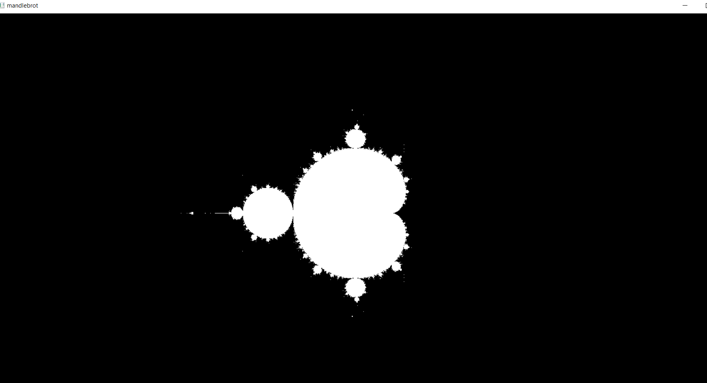

# Chaos

## Installation
clone this repository and execute the following commands:
   ### to install requirements:
          pip install -r requirements.txt 
   ### to try the codes:
          python program_name.py
  
## Mandelbrot set

## Lorenz-Attractor

## recaman-sequence

